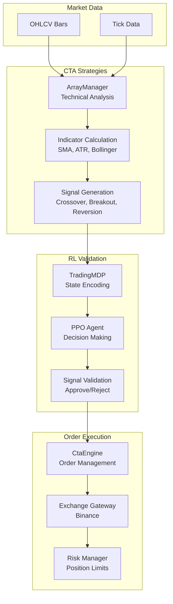
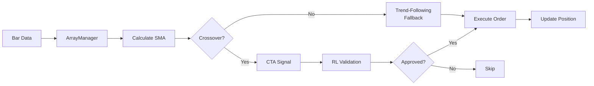
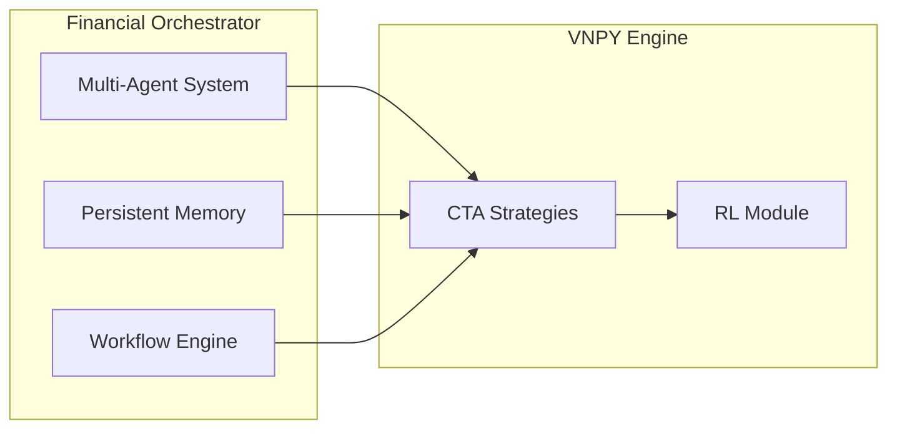

# VNPY Trading Engine

## Overview

The VNPY Trading Engine is a comprehensive algorithmic trading system integrated with the Financial Orchestrator. It provides CTA (Commodity Trading Advisor) strategy implementations enhanced with Reinforcement Learning (RL) for intelligent signal filtering.

## Purpose

- Implement professional-grade CTA strategies
- Enhance signals with RL-based validation
- Backtest and paper trade with realistic simulation
- Integrate with multi-agent system for automated trading

---

## Architecture

### Directory Structure

```
vnpy_engine/
├── vnpy_local/
│   ├── strategies/
│   │   └── cta_strategies.py     # 4 strategy implementations
│   ├── rl_module.py              # RL Agent (PPO + TradingMDP)
│   ├── market_data.py            # Market data handling
│   ├── main_engine.py            # Main trading engine
│   ├── api_gateway.py            # API gateway for exchanges
│   ├── risk_manager.py           # Risk management
│   ├── shared_state.py           # Shared state management
│   └── watchdog.py              # Process monitoring
├── tests/
│   ├── test_rl_cta_integration.py # 10 integration tests
│   ├── conftest.py                # Test fixtures
│   └── test_cta_strategies.py    # Strategy unit tests
├── config/
│   └── strategies.json           # Strategy configurations
├── Dockerfile
├── docker-compose.yml
└── .env.example                   # Environment variables template
```

### System Flow



---

## Strategy Implementations

### 1. MomentumCtaStrategy

SMA (Simple Moving Average) crossover strategy that follows trends.

**Logic:**
- Buy when fast SMA crosses above slow SMA
- Sell when fast SMA crosses below slow SMA

**Parameters:**
| Parameter | Type | Default | Description |
|-----------|------|---------|-------------|
| fast_window | int | 10 | Fast SMA period |
| slow_window | int | 30 | Slow SMA period |
| fixed_size | int | 1 | Order size |

**Code Location:** `cta_strategies.py:16-115`

---

### 2. MeanReversionCtaStrategy

Bollinger Bands-based strategy that trades mean reversion.

**Logic:**
- Buy when price touches lower Bollinger Band
- Sell when price touches upper Bollinger Band

**Parameters:**
| Parameter | Type | Default | Description |
|-----------|------|---------|-------------|
| boll_window | int | 20 | Bollinger Band period |
| boll_dev | float | 2.0 | Standard deviation multiplier |
| fixed_size | int | 1 | Order size |

**Code Location:** `cta_strategies.py:118-198`

---

### 3. BreakoutCtaStrategy

Channel breakout strategy that trades breakouts.

**Logic:**
- Buy when price breaks above highest high of lookback period
- Sell when price breaks below lowest low of lookback period

**Parameters:**
| Parameter | Type | Default | Description |
|-----------|------|---------|-------------|
| lookback_window | int | 20 | Lookback period for channel |
| fixed_size | int | 1 | Order size |

**Code Location:** `cta_strategies.py:209-290`

---

### 4. RlEnhancedCtaStrategy (MAIN)

CTA strategy enhanced with RL signal validation for intelligent filtering.

**Key Features:**
- Traditional SMA crossover signals
- RL agent validates signals before execution
- Trend-following fallback when no crossover occurs
- Graceful degradation when RL is disabled or errors

**Logic Flow:**


**Parameters:**
| Parameter | Type | Default | Description |
|-----------|------|---------|-------------|
| fast_window | int | 10 | Fast SMA period |
| slow_window | int | 30 | Slow SMA period |
| fixed_size | int | 1 | Order size |
| rl_enabled | bool | True | Enable RL validation |

**Code Location:** `cta_strategies.py:293-499`

---

## RL Module

### TradingMDP (Gym Environment)

Custom Gymnasium environment for trading decisions.

**Observation Space:**
```python
# Shape: (len(symbols) * 6,)
# Features per symbol:
# - price (normalized)
# - volume (normalized)
# - position (normalized)
# - pnl (normalized)
# - volatility (normalized)
# - trend (normalized)
```

**Action Space:**
```python
ACTIONS = ['hold', 'buy', 'sell', 'close']
# 0: hold - Do nothing
# 1: buy - Open long position
# 2: sell - Open short position
# 3: close - Close existing position
```

**Reward Calculation:**
- Profit/loss from trades
- Risk-adjusted returns (Sharpe ratio)
- Transaction cost penalty

**Code Location:** `rl_module.py:36-200`

---

### PPO Agent

Stable-Baselines3 PPO agent for decision making.

**Configuration:**
```python
model = PPO(
    "MlpPolicy",
    env,
    learning_rate=0.0003,
    n_steps=2048,
    batch_size=64,
    n_epochs=10,
    gamma=0.99,
    verbose=1
)
```

**Checkpoint Saving:**
- Interval: 1800 seconds (30 minutes)
- Directory: `memory/rl_checkpoints/`

**Code Location:** `rl_module.py:200-326`

---

## Configuration

### strategies.json

```json
{
  "strategies": [
    {
      "name": "RL_Strategy",
      "type": "rl",
      "symbol": "BTCUSDT",
      "enabled": true,
      "parameters": {
        "window_size": 50,
        "risk_threshold": 0.1,
        "learning_rate": 0.0003,
        "gamma": 0.99
      }
    },
    {
      "name": "Momentum_CTA",
      "type": "cta",
      "class": "MomentumCtaStrategy",
      "symbol": "BTCUSDT",
      "vt_symbol": "BTCUSDT.BINANCE",
      "enabled": true,
      "parameters": {
        "fast_window": 10,
        "slow_window": 30,
        "fixed_size": 1
      }
    },
    {
      "name": "RL_Enhanced_CTA",
      "type": "cta_rl",
      "class": "RlEnhancedCtaStrategy",
      "symbol": "BTCUSDT",
      "vt_symbol": "BTCUSDT.BINANCE",
      "enabled": true,
      "parameters": {
        "fast_window": 10,
        "slow_window": 30,
        "fixed_size": 1,
        "rl_enabled": true
      }
    }
  ],
  "gateways": {
    "binance": {
      "enabled": true,
      "mode": "paper",
      "symbols": ["BTCUSDT", "ETHUSDT", "BNBUSDT"]
    }
  }
}
```

### Environment Variables

| Variable | Default | Description |
|----------|---------|-------------|
| RL_CHECKPOINT_INTERVAL | 1800 | Checkpoint save interval (seconds) |
| LOG_LEVEL | INFO | Logging level |

---

## Setup

### Prerequisites

- Python 3.8+
- Linux/Unix system
- 4GB+ RAM

### Installation

```bash
# Clone repository
cd /home/ubuntu
git clone <repo_url>
cd financial_orchestrator

# Create virtual environment
python3 -m venv venv
source venv/bin/activate

# Install dependencies
pip install -r requirements.txt

# Verify installation
python -c "import vnpy; print(vnpy.__version__)"
```

### Dependencies (requirements.txt)

```
vnpy>=4.0.0
vnpy_ctastrategy>=1.4.0
stable-baselines3>=2.0.0
gymnasium>=0.29.0
numpy>=1.21.0
pytest>=7.0.0
```

---

## Running Tests

### All Tests

```bash
cd vnpy_engine
pytest tests/test_rl_cta_integration.py -v
```

### Specific Test

```bash
pytest tests/test_rl_cta_integration.py::TestRlEnhancedCTAIntegration::test_rl_agent_loads -v
```

### With Coverage

```bash
pytest tests/test_rl_cta_integration.py -v --cov=vnpy_local
```

### Test Results

```
============================== test session starts ==============================
platform linux -- Python 3.12.3, pytest-9.0.2, pluggy-1.6.0
cachedir: .pytest_cache
rootdir: /home/ubuntu
collected 10 items

test_rl_agent_loads PASSED                                          [ 10%]
test_cta_signal_validated_by_rl PASSED                              [ 20%]
test_rl_filter_approves_valid_signals PASSED                        [ 30%]
test_rl_filter_rejects_invalid_signals PASSED                      [ 40%]
test_fallback_when_rl_disabled PASSED                               [ 50%]
test_fallback_on_rl_error PASSED                                   [ 60%]
test_rl_reduces_whipsaws PASSED                                    [ 70%]
test_rl_preserves_trend_following PASSED                           [ 80%]
test_full_trading_cycle PASSED                                      [ 90%]
test_multiple_strategies_compare PASSED                            [100%]

============================== 10 passed in 1.63s ==============================
```

---

## Test Coverage (10 Tests)

| Test | Purpose |
|------|---------|
| `test_rl_agent_loads` | RL agent loads on strategy initialization |
| `test_cta_signal_validated_by_rl` | CTA signals are validated by RL agent |
| `test_rl_filter_approves_valid_signals` | RL approves valid CTA signals |
| `test_rl_filter_rejects_invalid_signals` | RL rejects invalid CTA signals |
| `test_fallback_when_rl_disabled` | Strategy works when RL is disabled |
| `test_fallback_on_rl_error` | Strategy falls back when RL errors |
| `test_rl_reduces_whipsaws` | RL filter reduces false signals in ranging market |
| `test_rl_preserves_trend_following` | RL doesn't filter out good trend signals |
| `test_full_trading_cycle` | Complete trading cycle: init → trade → close |
| `test_multiple_strategies_compare` | Multiple strategy types compared on same data |

---

## Key Technical Details

### CtaTemplate Requirements

The VN.PY CtaTemplate base class requires specific setup:

```python
class MyStrategy(CtaTemplate):
    def __init__(self, cta_engine, strategy_name, vt_symbol, setting):
        super().__init__(cta_engine, strategy_name, vt_symbol, setting)
        self.am = ArrayManager(100)
    
    def on_init(self) -> None:
        self.inited = True
        self.load_bar(10, Interval.MINUTE, self.on_bar)
    
    def on_start(self) -> None:
        self.trading = True  # Required for order execution!
```

**Critical:** `strategy.trading = True` must be set for orders to execute.

### ArrayManager

Technical analysis container in VN.PY:

- **Default size:** 100 bars
- **Inited status:** `am.inited = True` after 100 bars
- **Calculations:** SMA, EMA, ATR, Bollinger Bands, etc.

```python
self.am = ArrayManager(100)
self.am.update_bar(bar)

if not self.am.inited:
    return  # Wait for 100 bars

self.fast_ma = self.am.sma(self.fast_window)
self.slow_ma = self.am.sma(self.slow_window)
self.atr = self.am.atr(14)
```

### RL Validation Logic

```python
def _validate_with_rl(self, bar: BarData, cta_signal: int) -> bool:
    """Validate CTA signal with RL agent."""
    market_state = {
        symbol: {
            "price": bar.close_price,
            "volume": bar.volume,
            "position": self.pos,
            "pnl": 0.0,
            "volatility": self.am.atr(14),
            "trend": cta_signal
        }
    }
    
    decision = self.rl_agent.get_action_with_risk(market_state)
    
    if cta_signal > 0 and decision["action"] == "buy":
        return True
    elif cta_signal < 0 and decision["action"] == "sell":
        return True
    
    return False
```

### Trend-Following Fallback

When no crossover occurs, the strategy falls back to trend-following:

```python
# Lines 393-403 in cta_strategies.py
else:
    # Trend-following fallback when no crossover
    if self.pos == 0:
        if self.fast_ma > self.slow_ma:
            self.buy(bar.close_price, self.fixed_size)
        elif self.fast_ma < self.slow_ma:
            self.short(bar.close_price, self.fixed_size)
    elif self.pos > 0 and self.fast_ma < self.slow_ma:
        self.sell(bar.close_price, abs(self.pos))
    elif self.pos < 0 and self.fast_ma > self.slow_ma:
        self.cover(bar.close_price, abs(self.pos))
```

---

## Troubleshooting

### No Trades Executed

**Symptoms:** Strategy runs but no orders are placed.

**Causes:**
1. `trading = False` (CtaTemplate blocks orders)
2. ArrayManager not inited (less than 100 bars)
3. No crossover signals generated

**Solutions:**
```python
# Always set trading = True after on_init()
strategy.on_init()
strategy.trading = True  # Required!

# Use enough bars
bars = gen.generate_trending_bars(n=200, trend="up")  # 200 bars
```

### ArrayManager Not Inited

**Symptoms:** `assert am.inited` fails

**Cause:** Less than 100 bars processed

**Solution:**
```python
# Generate more bars
bars = gen.generate_trending_bars(n=150, trend="up")
for bar in bars:
    strategy.on_bar(bar)
```

### RL Validation Always Passes

**Symptoms:** RL never rejects signals

**Cause:** Mock RL agent setup incorrect

**Solution:**
```python
# Return "hold" to reject
mock_rl_agent.get_action_with_risk.return_value = {
    "action": "hold",  # This rejects the signal
    "action_idx": 0
}
```

---

## Docker Deployment

### Dockerfile

```dockerfile
FROM python:3.12-slim

WORKDIR /app
COPY requirements.txt .
RUN pip install --no-cache-dir -r requirements.txt

COPY vnpy_engine/ ./vnpy_engine/
COPY .env.example ./.env

CMD ["python", "-m", "pytest", "vnpy_engine/tests/", "-v"]
```

### docker-compose.yml

```yaml
version: '3.8'
services:
  vnpy-engine:
    build: .
    environment:
      - RL_CHECKPOINT_INTERVAL=1800
      - LOG_LEVEL=INFO
    volumes:
      - ./memory:/app/memory
      - ./logs:/app/logs
```

---

## Integration with Financial Orchestrator

The VNPY Trading Engine integrates with the Financial Orchestrator:



---

## File Locations

| Component | File Path |
|-----------|-----------|
| CTA Strategies | `vnpy_engine/vnpy_local/strategies/cta_strategies.py` |
| RL Module | `vnpy_engine/vnpy_local/rl_module.py` |
| Test Fixtures | `vnpy_engine/tests/conftest.py` |
| Integration Tests | `vnpy_engine/tests/test_rl_cta_integration.py` |
| Configuration | `vnpy_engine/config/strategies.json` |

---

## References

- [VN.PY Documentation](https://www.vnpy.com/docs/)
- [Stable Baselines3](https://stable-baselines3.readthedocs.io/)
- [Gymnasium](https://gymnasium.farama.org/)
