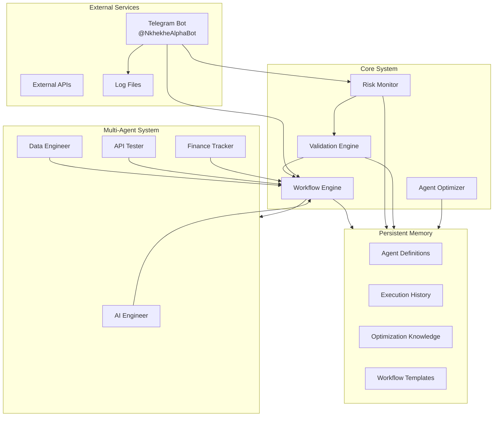
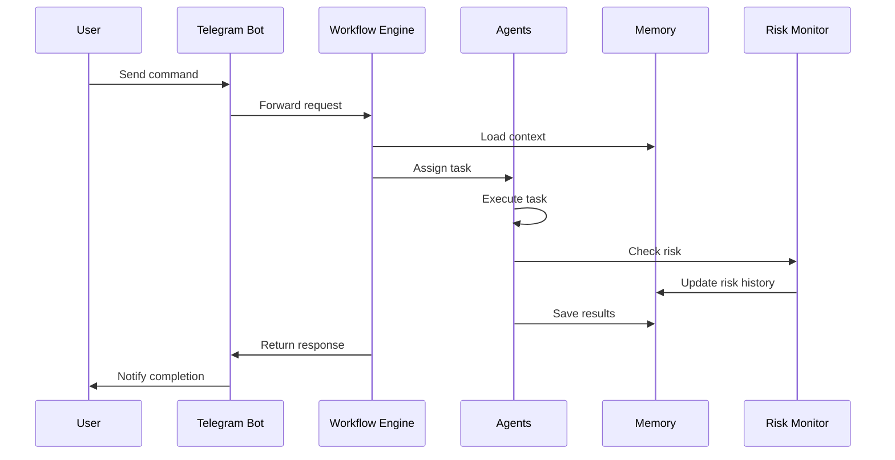
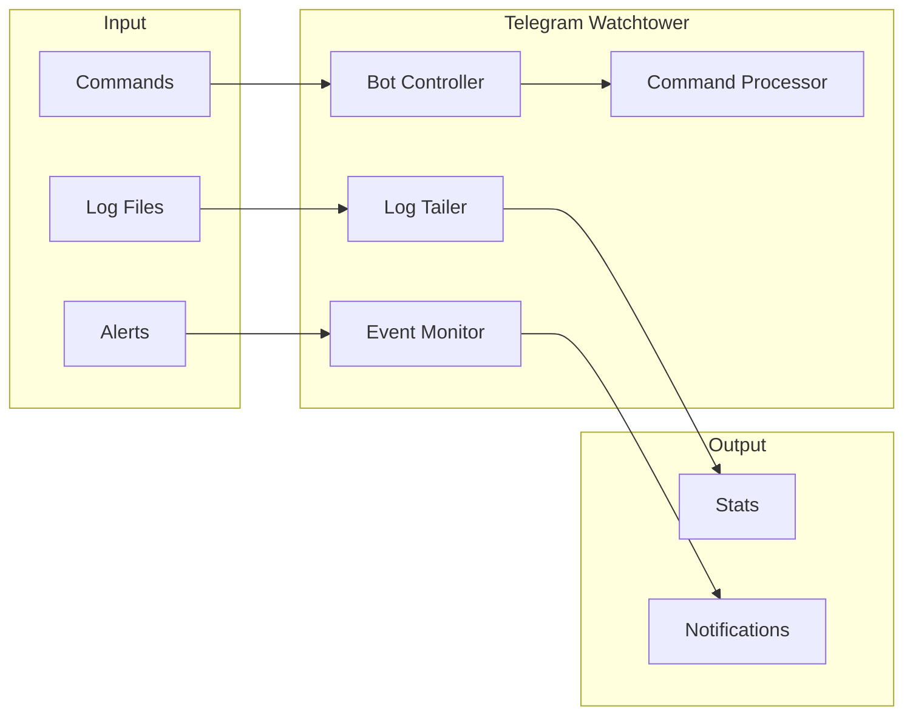

# Architecture Diagrams

## System Architecture (Mermaid)



## Data Flow



## Directory Structure

```
financial_orchestrator/
├── agents/                    # Agent YAML configurations
│   ├── ai_engineer_config.yaml
│   ├── data_engineer_config.yaml
│   ├── api_tester_config.yaml
│   └── finance_tracker_config.yaml
├── memory/                    # Persistent memory storage
│   ├── agent_definitions/     # Agent configs in memory format
│   ├── execution_history/     # Session & execution logs
│   ├── optimization_knowledge/ # Learned optimizations
│   └── workflow_templates/    # Reusable workflow templates
├── workflows/                 # Workflow definitions
├── monitoring/                # Risk monitoring
├── optimization/              # Agent optimization
├── validation/                # Validation rules & schemas
├── telegram_watchtower/       # Telegram bot system
└── docs/                      # Documentation
```

## Telegram Watchtower Flow


