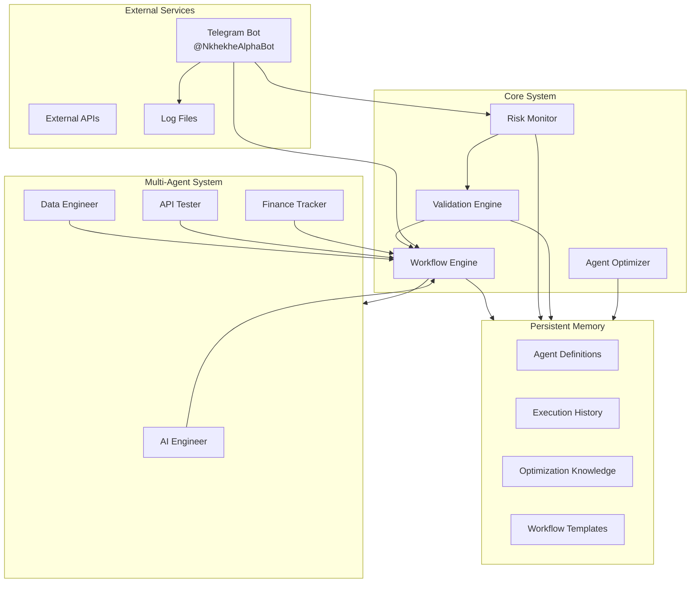
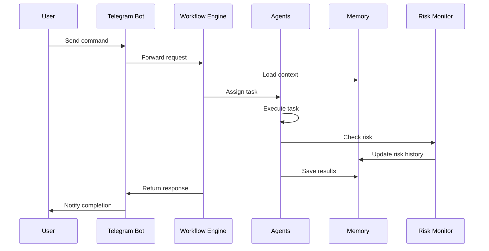
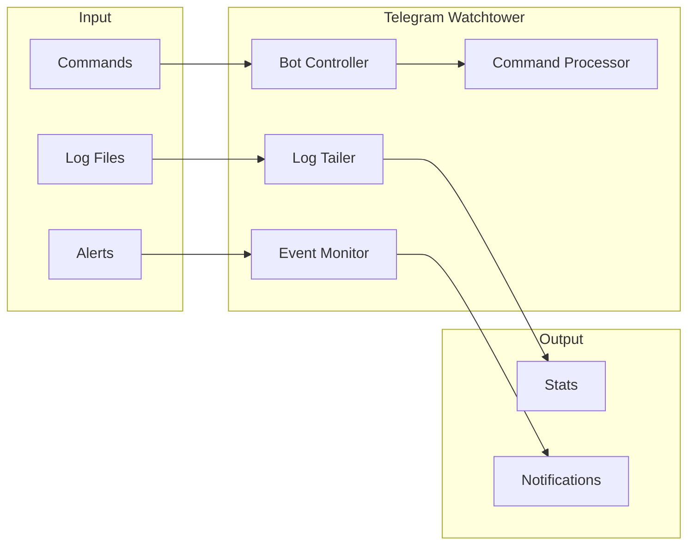
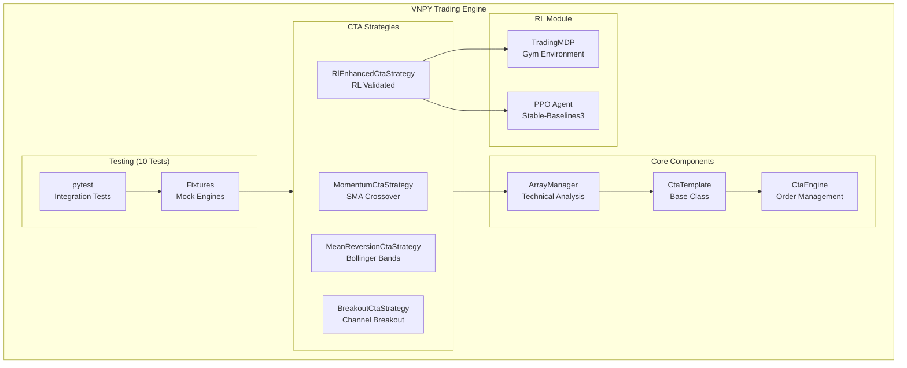
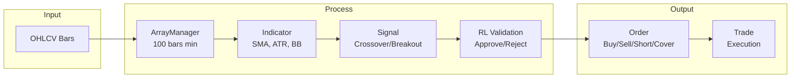

# Architecture Diagrams

## System Architecture (Mermaid)



## Data Flow



## Directory Structure

```
financial_orchestrator/
├── agents/                    # Agent YAML configurations
│   ├── ai_engineer_config.yaml
│   ├── data_engineer_config.yaml
│   ├── api_tester_config.yaml
│   └── finance_tracker_config.yaml
├── memory/                    # Persistent memory storage
│   ├── agent_definitions/     # Agent configs in memory format
│   ├── execution_history/     # Session & execution logs
│   ├── optimization_knowledge/ # Learned optimizations
│   └── workflow_templates/    # Reusable workflow templates
├── workflows/                 # Workflow definitions
├── monitoring/                # Risk monitoring
├── optimization/              # Agent optimization
├── validation/                # Validation rules & schemas
├── telegram_watchtower/       # Telegram bot system
└── docs/                      # Documentation
```

## Telegram Watchtower Flow



## VNPY Trading Engine Architecture



### VNPY Strategy Data Flow



### Directory Structure - VNPY Engine

```
vnpy_engine/
├── vnpy_local/
│   ├── strategies/
│   │   └── cta_strategies.py     # 4 CTA strategies
│   ├── rl_module.py              # RL agent & MDP
│   ├── market_data.py            # Market data
│   ├── main_engine.py            # Main engine
│   ├── api_gateway.py            # Exchange API
│   ├── risk_manager.py           # Risk management
│   └── shared_state.py           # State management
├── tests/
│   ├── test_rl_cta_integration.py # 10 tests
│   ├── conftest.py               # Test fixtures
│   └── test_cta_strategies.py
├── config/
│   └── strategies.json
├── Dockerfile
└── docker-compose.yml
```

### Key Components

| Component | File | Purpose |
|-----------|------|---------|
| MomentumCtaStrategy | cta_strategies.py:16 | SMA crossover |
| MeanReversionCtaStrategy | cta_strategies.py:118 | Bollinger Bands |
| BreakoutCtaStrategy | cta_strategies.py:209 | Channel breakout |
| RlEnhancedCtaStrategy | cta_strategies.py:293 | RL-validated |
| TradingMDP | rl_module.py:36 | Gym environment |
| PPO Agent | rl_module.py:200 | Decision making |
| MockCtaEngine | conftest.py:185 | Testing |
| SyntheticDataGenerator | conftest.py:22 | Test data |
